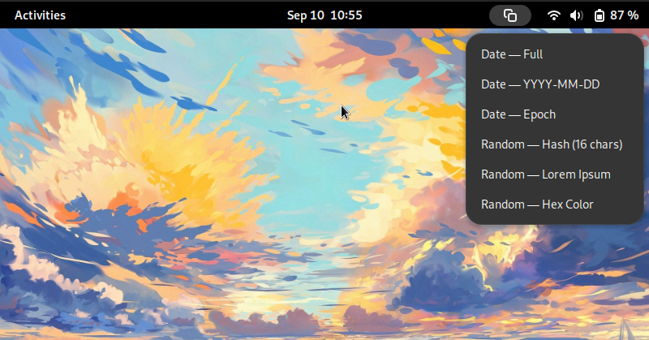

# Strings Extension

A simple extension to paste useful strings, like the current day as YYYY-MM-DD, or lorem ipsum, and more.

You select an option, and it copies it in your clipboard, that's it.

I eventually plan to add some small clipboard manipulation too, like trim, base64, etc.
